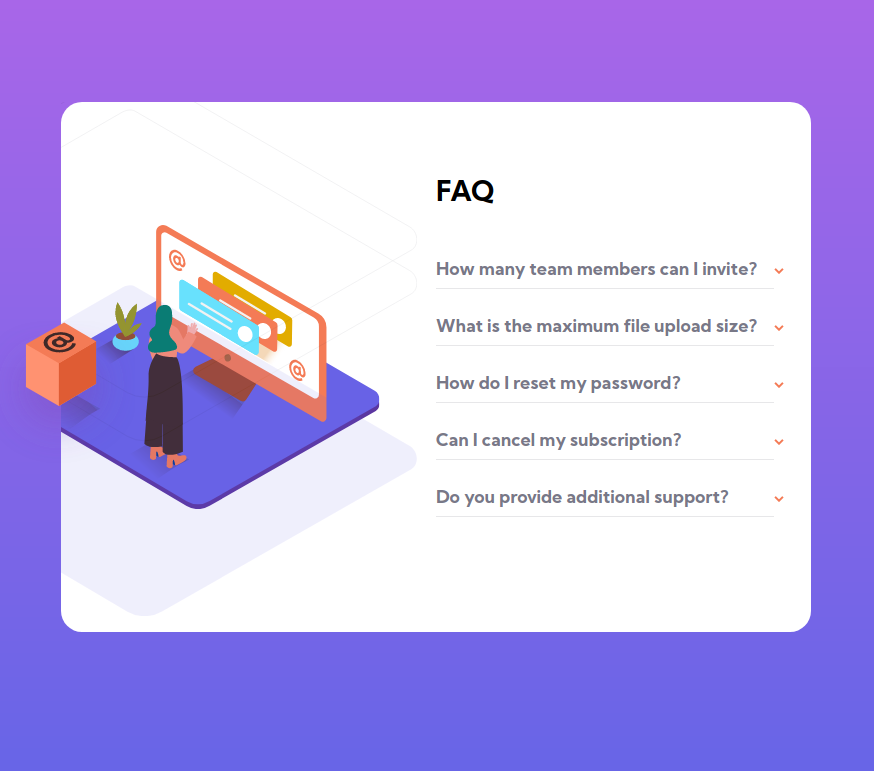

# Frontend Mentor - FAQ accordion card solution

This is a solution to the [FAQ accordion card challenge on Frontend Mentor](https://www.frontendmentor.io/challenges/faq-accordion-card-XlyjD0Oam). Frontend Mentor challenges help you improve your coding skills by building realistic projects. 

## Table of contents

- [Overview](#overview)
  - [The challenge](#the-challenge)
  - [Screenshot](#screenshot)
  - [Links](#links)
- [My process](#my-process)
  - [Built with](#built-with)
  - [What I learned](#what-i-learned)
  - [Continued development](#continued-development)
- [Author](#author)

## Overview

### The challenge

Users should be able to:

- View the optimal layout for the component depending on their device's screen size
- See hover states for all interactive elements on the page
- Hide/Show the answer to a question when the question is clicked

### Screenshot

The image above is the result of the design.

### Links

- Solution URL: [Visit]()
- Live Site URL: [Visit]()

## My process

### Built with

- Semantic HTML5 markup
- CSS custom properties
- Flexbox
- CSS Grid

### What I learned

I learned to position items and make them fix where the layout needed.

### Continued development

I'd like to improve the time to make fix things.

## Author

+ Website - [www.angelpineda.com.mx](https://www.angelpineda.com.mx)
+ Frontend Mentor - [@angelp495](https://www.frontendmentor.io/profile/angelp495)
+ Twitter - [@AOcelopilli](https://twitter.com/AOcelopilli)

